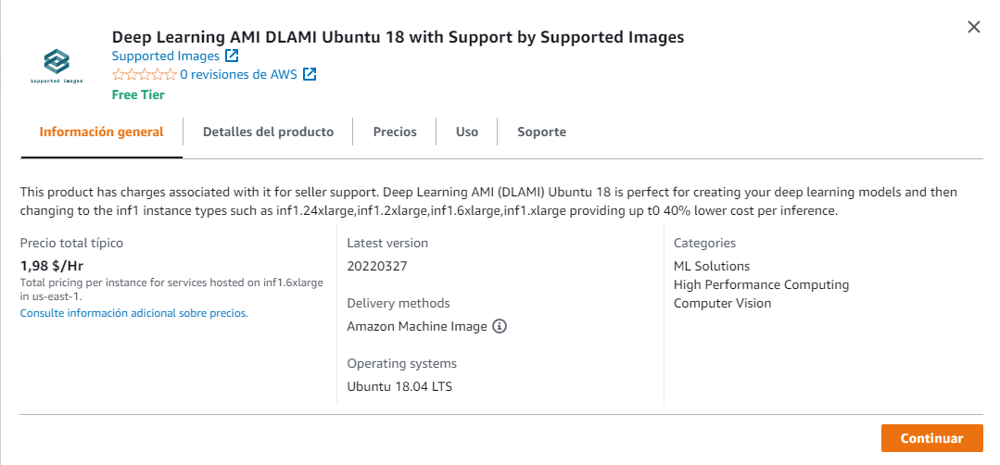

# Requirements

## AWS

- AWS EC2 Deep Learning AMI DLAMI



## Local

- Nvidia Docker runtime: https://github.com/NVIDIA/nvidia-docker#quickstart
- CUDA 10.0 or higher on your host, check with nvidia-smi

Please check:

- https://hub.docker.com/r/cwaffles/openpose
- https://hub.docker.com/r/cwaffles/openpose

# Installation


```
git clone https://github.com/ManuelEV/openpose-docker-deploy

cd ./openpose-docker-deploy

sudo docker build -t openpose .

docker run -d -p 5000:5000 --gpus all -e NVIDIA_VISIBLE_DEVICES=0 --name openpose -it openpose /bin/bash

gunicorn --bind 0.0.0.0:5000 wsgi:app

```
